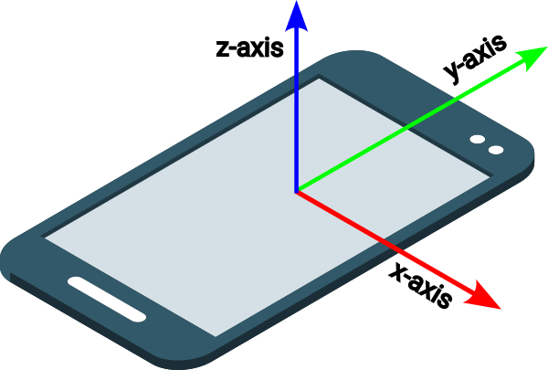

In CSS, `z-index` is a property that controls the layer order of elements on the z-axis (the axis that comes out of the screen towards the viewer). 

You can use the `z-index` property to make elements appear in front of or behind each other. 

Styling an element with z-index of `1`, will cause it to appear on the 'top' layer in front of other elements, (which are set to `0` by default).