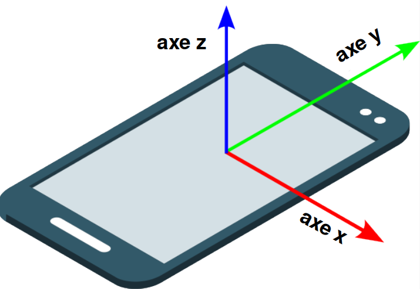

En CSS, `z-index` est une propriété qui contrôle l'ordre des calques des éléments sur l'axe z (l'axe qui sort de l'écran vers l'utilisateur).

Tu peux utiliser la propriété `z-index` pour faire apparaître les éléments les uns devant ou derrière les autres.

Le style d'un élément avec un z-index de `1` le fera apparaître sur la couche 'top' (supérieure) devant les autres éléments (qui sont définis sur `0` par défaut).