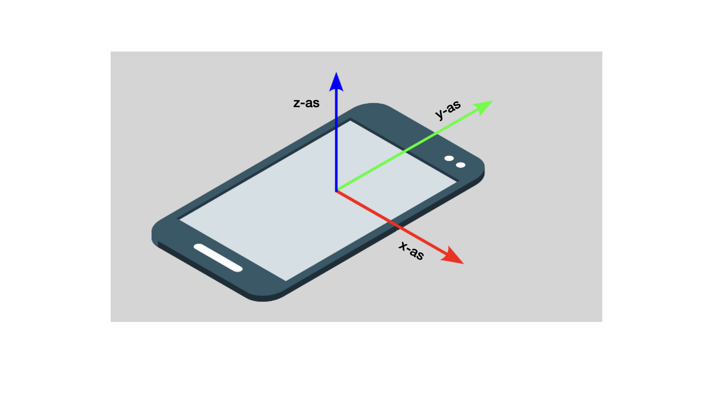

In CSS is `z-index` een eigenschap die de volgorde van elementen op de z-as (de as die van het scherm naar de kijker toe wijst) bepaalt.

Je kunt de `z-index` eigenschap gebruiken om elementen voor of achter elkaar te laten verschijnen.

Styling an element with a z-index of `1`, will cause it to appear on the 'top' layer in front of other elements (which are set to `0` by default).
